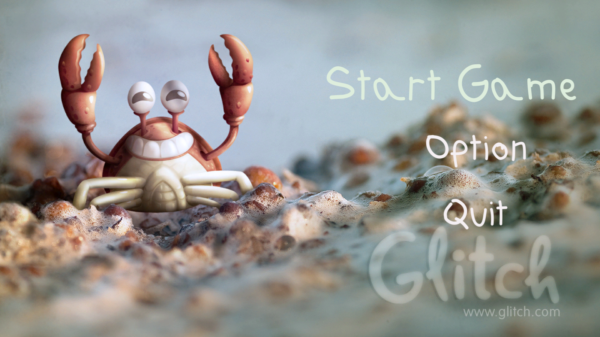

# Glitch-Garden
A tower defense garden-themed game. It is the basic clone of the popular plants vs zombies game.

The game is meant to cover the following subjects:
  1. Unity's Basic Animation System; animation components, keyframe animation & basic animation transitions.
  2. Unity's UI and how to save player settings.
  3. Level Design

